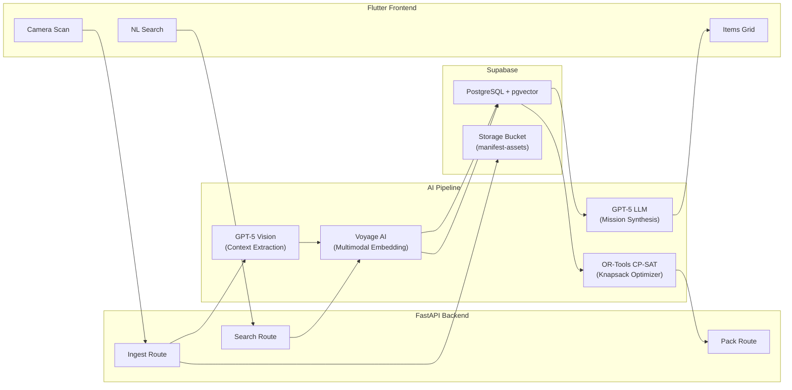

# Nexus

**AI-powered packing intelligence for missions, travel, and logistics.**

Nexus turns your physical inventory into a searchable, semantically-rich vector database. Photograph your items, describe your mission in plain English, and get an optimized, LLM-explained packing manifest in seconds.

---

## Architecture



### Data Flows

**Ingest** — Image → GPT-5 Vision extracts structured context (material, thermal rating, medical use, durability, tags) → Voyage AI generates 1024-dim multimodal embedding → Supabase upsert + Storage upload

**Search** — Natural language query → Voyage AI embeds query → pgvector cosine similarity search → GPT-5 LLM curates results into an explained mission plan

**Pack** — Search results → OR-Tools CP-SAT bounded knapsack solver (weight limits, category diversity, tag requirements) → Optimized manifest with constraint relaxation reporting

---

## Tech Stack

| Layer | Technology |
|---|---|
| **Languages** | Python 3.13, Dart, SQL |
| **Frontend** | Flutter (Material 3), Dio, Supabase Flutter SDK, Image Picker |
| **Backend** | FastAPI, Uvicorn, Pydantic, HTTPX |
| **AI — Vision** | OpenAI GPT-5 Vision (structured context extraction) |
| **AI — Embeddings** | Voyage AI `voyage-multimodal-3.5` (1024-dim), CLIP ViT-B-32 (offline fallback) |
| **AI — Synthesis** | OpenAI GPT-5 (mission plan curation) |
| **Optimization** | Google OR-Tools CP-SAT Solver (bounded knapsack) |
| **Database** | Supabase PostgreSQL + pgvector |
| **Storage** | Supabase Storage (`manifest-assets` bucket) |
| **Utilities** | NumPy, Pillow, python-dotenv |

---

## Project Structure

```
nexus/
├── backend/
│   ├── ai_modules/              # Core AI pipeline
│   │   ├── config.py            # API keys, model config, constants
│   │   ├── context_extractor.py # GPT-5 Vision → structured ItemContext
│   │   ├── embedding_engine.py  # Voyage multimodal + CLIP fallback
│   │   ├── knapsack_optimizer.py# OR-Tools CP-SAT bounded knapsack
│   │   ├── mission_synthesizer.py# GPT-5 mission plan generation
│   │   ├── models.py            # Pydantic data models
│   │   ├── pipeline.py          # Top-level orchestrator (ingest/search/pack)
│   │   ├── vector_store.py      # Supabase pgvector integration
│   │   └── test_images/         # Sample images (camping, clothing, medical, tech)
│   ├── server/                  # FastAPI HTTP layer
│   │   ├── main.py              # App entry point, CORS, lifespan
│   │   ├── dependencies.py      # Singleton pipeline injection
│   │   ├── schemas.py           # Request/response Pydantic models
│   │   └── routes/
│   │       ├── ingest.py        # POST /api/v1/ingest, /ingest/upload
│   │       ├── search.py        # POST /api/v1/search/semantic
│   │       ├── pack.py          # POST /api/v1/pack
│   │       ├── items.py         # GET  /api/v1/items
│   │       └── containers.py    # CRUD /api/v1/containers
│   ├── migrations/              # SQL migrations (001–013)
│   ├── requirements.txt         # All Python dependencies
│   ├── seed_test_images.py      # Batch ingest local test images
│   ├── seed_dummyjson.py        # Batch ingest from DummyJSON API
│   └── .env                     # Environment variables (not committed)
├── frontend/
│   ├── lib/
│   │   ├── main.dart            # Flutter app (4-tab UI)
│   │   └── api_service.dart     # Backend API client
│   ├── pubspec.yaml             # Dart dependencies
│   └── .env                     # Frontend environment variables
└── README.md                    # This file
```

---

## Setup

### Prerequisites

- Python 3.13+
- Flutter SDK 3.2+
- A [Supabase](https://supabase.com) project with pgvector enabled
- API keys: [OpenAI](https://platform.openai.com), [Voyage AI](https://voyageai.com)

### 1. Database Setup

1. Open your Supabase project dashboard.
2. Go to **SQL Editor** and run the migrations in order:
   ```
   backend/migrations/001_extensions.sql
   backend/migrations/002_enums.sql
   backend/migrations/003_profiles.sql
   backend/migrations/004_manifest_items.sql
   backend/migrations/005_missions.sql
   backend/migrations/006_mission_items.sql
   backend/migrations/007_rls_policies.sql
   backend/migrations/008_vector_search.sql
   backend/migrations/009_storage_policies.sql
   backend/migrations/010_allow_null_user_id.sql
   backend/migrations/011_storage_containers.sql
   backend/migrations/012_enhanced_context_fields.sql
   backend/migrations/013_enhanced_vector_search.sql
   ```
   Or run `000_run_all_manifest.sql` which includes all of the above.
3. Go to **Storage** → **New bucket** → Name: `manifest-assets` → Public: **ON**.

### 2. Backend Setup

```bash
cd backend

# Create virtual environment
python -m venv .venv
# Windows:
.\.venv\Scripts\Activate.ps1
# macOS/Linux:
source .venv/bin/activate

# Install all dependencies
pip install -r requirements.txt

# Configure environment
cp .env.example .env   # Then edit with your API keys
```

**`backend/.env`** requires:

| Variable | Description |
|---|---|
| `OPENAI_API_KEY` | OpenAI API key (for GPT-5 Vision + synthesis) |
| `VOYAGE_API_KEY` | Voyage AI API key (for multimodal embeddings) |
| `SUPABASE_URL` | Supabase project URL |
| `SUPABASE_SERVICE_KEY` | Supabase **service_role** key (not the anon key) |
| `API_BASE_URL` | Backend URL, default `http://localhost:8000` |

**Run the server:**

```bash
python -m uvicorn server.main:app --reload --port 8000
```

API docs available at `http://localhost:8000/docs`.

### 3. Frontend Setup

```bash
cd frontend

# Install Dart dependencies
flutter pub get
```

Create `frontend/.env`:
```
SUPABASE_URL=https://your-project.supabase.co
SUPABASE_ANON_KEY=your-anon-key
API_BASE_URL=http://localhost:8000
```

**Run the app:**

```bash
flutter run
```

---

## Seed Data

Populate your Supabase database with sample items:

**Local test images** (34 items across camping, clothing, medical, tech):
```bash
cd backend
python seed_test_images.py
```

**DummyJSON products** (100 diverse items from a public API):
```bash
cd backend
python seed_dummyjson.py
```

Each seed script uploads images to Supabase Storage, runs GPT-5 Vision context extraction, generates Voyage multimodal embeddings, and upserts everything into the `manifest_items` table.

---

## API Endpoints

All routes are prefixed with `/api/v1`.

| Method | Endpoint | Description |
|---|---|---|
| `POST` | `/ingest` | Ingest item by image URL |
| `POST` | `/ingest/upload` | Ingest item by file upload |
| `POST` | `/search/semantic` | Natural language semantic search |
| `GET` | `/items` | List all items in the database |
| `POST` | `/pack` | Search + knapsack optimization |
| `GET/POST` | `/containers` | CRUD for storage containers |
| `GET` | `/health` | Health check |

---

## AI Pipeline Detail

### 1. Context Extraction (`context_extractor.py`)
GPT-5 Vision analyzes each item photo and returns structured JSON: name, category, material, weight estimate, thermal rating, water resistance, medical application, utility summary, semantic tags, durability, and compressibility.

### 2. Multimodal Embedding (`embedding_engine.py`)
Voyage AI `voyage-multimodal-3.5` processes interleaved image + text through a single transformer backbone, producing a 1024-dimensional vector. Supports Matryoshka flexible dimensions (2048, 1024, 512, 256). Local CLIP ViT-B-32 available as offline fallback.

### 3. Vector Storage & Search (`vector_store.py`)
Supabase PostgreSQL with pgvector extension. Custom `match_manifest_items` RPC function performs filtered cosine similarity search with optional user and category scoping.

### 4. Mission Synthesis (`mission_synthesizer.py`)
GPT-5 curates raw search results into explained mission plans. Filters dangerous items (e.g., cotton in cold weather), flags critical gaps, identifies cross-domain utility, and provides per-item reasoning.

### 5. Knapsack Optimization (`knapsack_optimizer.py`)
Google OR-Tools CP-SAT solver handles bounded knapsack with category diversity minimums, tag requirements, and inventory constraints. Progressive constraint relaxation when no feasible solution exists. Supports multi-container bin-packing.

---

## License

MIT
